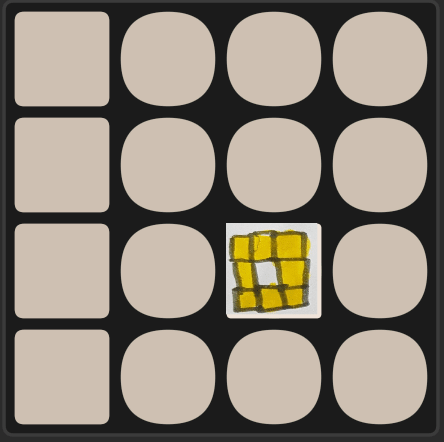

very WIP 2048 clone based on https://blog.korge.org/korge-tutorial-writing-2048-game-step-3-animation

98% of the code comes from the tutorial

Just to get a feel of what using KorGe feels like

Using my son's drawing 

